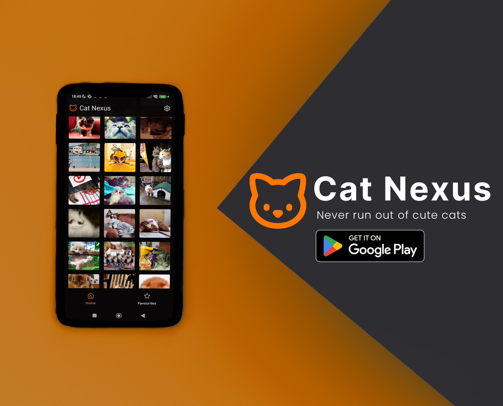

# Cat Nexus

Cat Nexus is a modern built Android app to scroll through an infinite list of cat pictures and download your favourites.

It was originally created to teach new students the basics of Android development in a fun way, and has been polished up for release on Google Play Store to gain experience on that part of the application lifecycle.

## Features
- Infinitely scrollable list of cats
- View the cat in full detail, zoom in to admire their beauty closer
- Easily share the cat with your friends
- Favourite cats to easily find them again
- Download the cat picture, with notifications to show it in-progress and being completed
- Also supports cat GIFs!

## Architecture
The app was built following the MVVM architecture.

## Technologies
- Kotlin
- Kotlin Coroutines
- Jetpack Compose
- Retrofit
- Room
- Coil
- Hilt
- Compose Destinations
- Sentry
